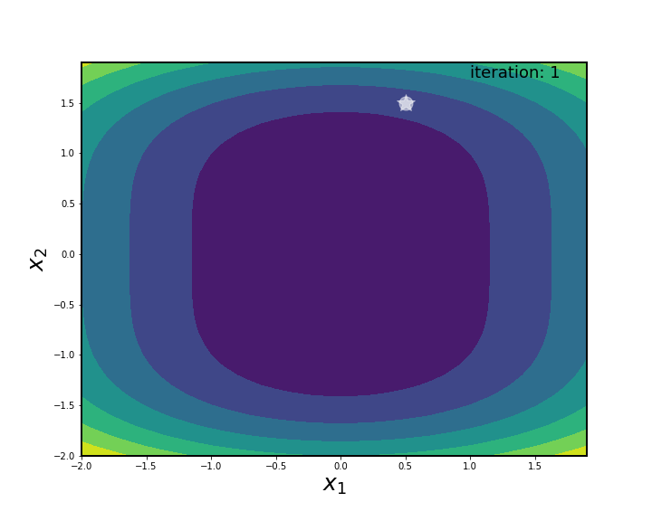

# OptKit
*OptKit* is a mathematical optimization library written in python and still in development. It focuses on visualization of optimization algorithms for 1D/2D problems. The goal of OptKit is not to perform large scale optimization but provide intuitive understanding of how these algorithms work. 

